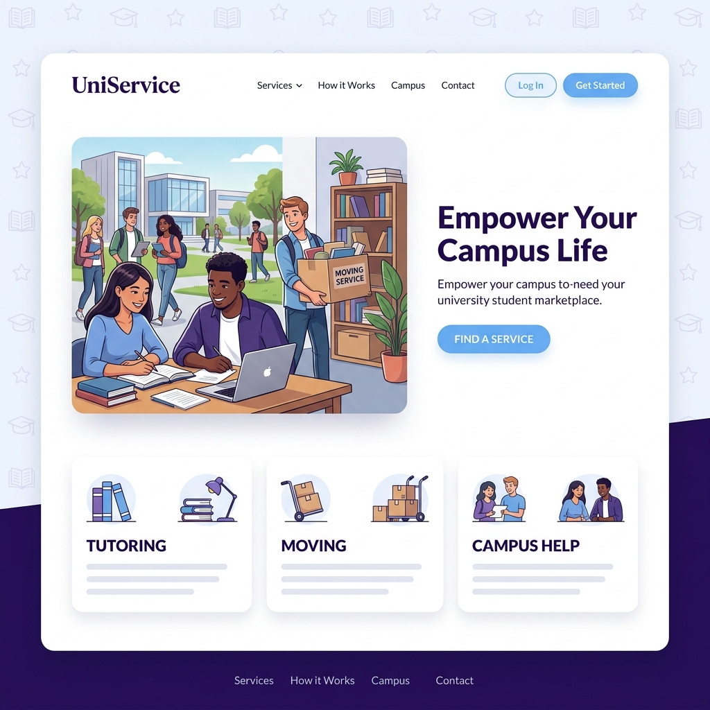

# 🎓 UniService Marketplace

[](https://vitejs.dev/)
[](https://reactjs.org/)
[](https://www.typescriptlang.org/)
[](https://tailwindcss.com/)
[](https://opensource.org/licenses/MIT)

**UniService** is a premium, peer-to-peer marketplace built specifically for university students. It empowers campus life by connecting students who need help with those who have skills to share—from tutoring and moving to cleaning and creative services.



---

## ✨ Features

- 🤝 **Peer-to-Peer Services**: Connect directly with fellow students for a wide range of tasks.
- 🛡️ **Verified Community**: Exclusive access for university students, ensuring a safe and trusted environment.
- ⚡ **Seamless Experience**: Modern, intuitive UI/UX designed for speed and ease of use.
- 🏢 **Multi-Role Dashboards**:
  - **Students**: Easily browse and request services, track progress, and leave reviews.
  - **Providers**: Showcase skills, manage jobs, and earn income on your own schedule.
  - **Admins**: Robust tools for platform management and user moderation.
- 🎨 **Premium Design**: Built with a sophisticated aesthetic using Radix UI and Shadcn/UI.
- 📱 **Fully Responsive**: Optimized for every device, from desktop to mobile.

---

## 🛠️ Tech Stack

- **Framework**: [React 18](https://reactjs.org/) with [Vite](https://vitejs.dev/)
- **Language**: [TypeScript](https://www.typescriptlang.org/)
- **Styling**: [Tailwind CSS](https://tailwindcss.com/)
- **Animations**: [Framer Motion](https://www.framer.com/motion/)
- **UI Components**: [Shadcn UI](https://ui.shadcn.com/) & [Radix UI](https://www.radix-ui.com/)
- **Icons**: [Lucide React](https://lucide.dev/)
- **Data Fetching**: [TanStack Query](https://tanstack.com/query/latest)
- **Routing**: [React Router](https://reactrouter.com/)

---

## 🚀 Getting Started

### Prerequisites

- [Node.js](https://nodejs.org/) (Version 18 or higher recommended)
- [npm](https://www.npmjs.com/) or [Bun](https://bun.sh/)

### Local Setup

1. **Clone the repository**:
   ```sh
   git clone https://github.com/your-username/uni-service.git
   cd uni-service
   ```

2. **Navigate to the project directory**:
   ```sh
   cd uni-service-main
   ```

3. **Install dependencies**:
   ```sh
   npm install
   # or if using bun
   bun install
   ```

4. **Start the development server**:
   ```sh
   npm run dev
   ```
   The app will be available at `http://localhost:8080`.

---

## 📂 Project Structure

```text
src/
├── components/     # Reusable UI & Layout components
├── hooks/          # Custom React hooks
├── lib/            # Utility functions & shared logic
├── pages/          # Main page components & dashboards
│   └── dashboards/ # Specialized role-based dashboards
└── App.tsx         # Main application entry & routing
```

---

## 🌐 Deployment

This project is configured for easy deployment on **Vercel**. 

Simply push your changes to GitHub and connect your repository to Vercel. The `vercel.json` ensures professional client-side routing.

---

## 🤝 Contributing

We believe in the power of student collaboration! If you'd like to contribute:
1. Fork the Project
2. Create your Feature Branch (`git checkout -b feature/AmazingFeature`)
3. Commit your Changes (`git commit -m 'Add some AmazingFeature'`)
4. Push to the Branch (`git checkout origin feature/AmazingFeature`)
5. Open a Pull Request

---

## 📄 License

Distributed under the MIT License. See `LICENSE` for more information.

---

<p align="center">
  Built with ❤️ for students, by students.
</p>
